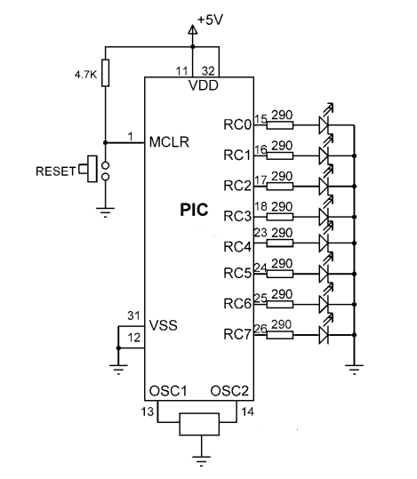

# Chasing LEDs

## Description

This project drives eight LEDs from PORTC of the PIC18F4620. Only one LED is turned on at a time, and the active LED moves across the port once every second, creating a chasing-light effect.

## Hardware

- PIC18F4620
- PICkit 3
- 8 LEDs
- 8 x 330 ohm resistors
- 8 MHz crystal
- 2 x 22 pF capacitors
- 5 V power supply

## Code

See [main.c](main.c).

## Circuit

<!-- Add your circuit diagram and real breadboard photo here. -->
 
